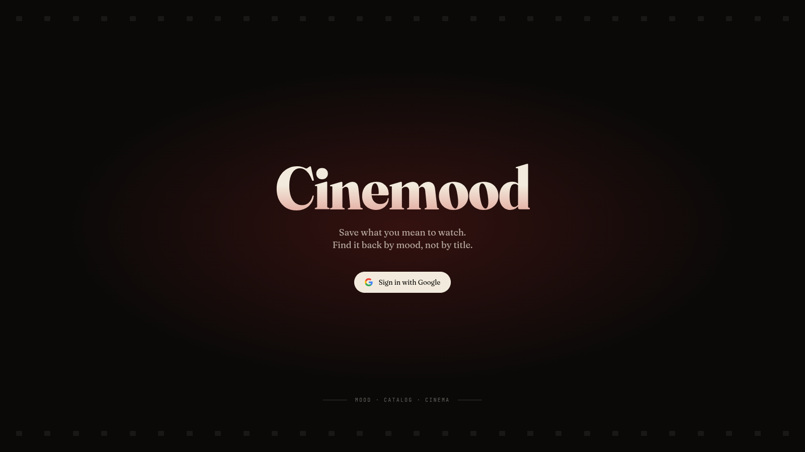
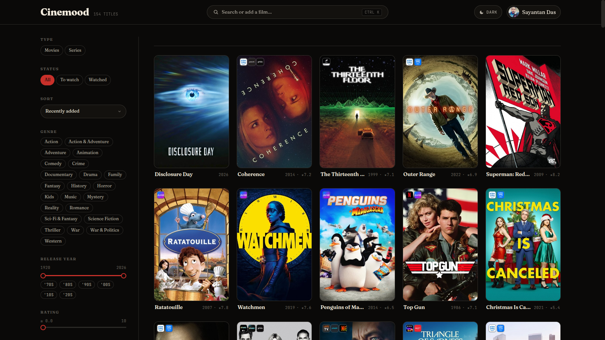
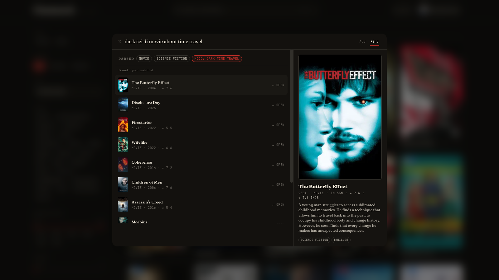
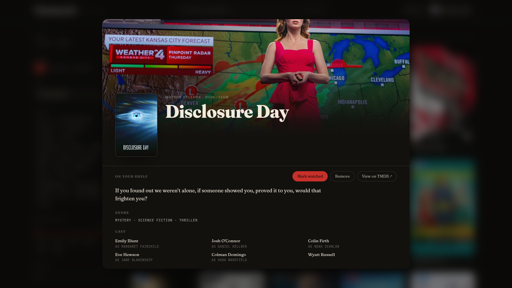
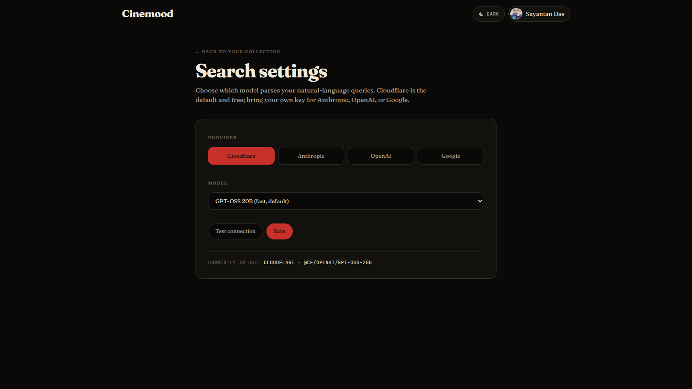

<div align="center">

# Cinemood

**Save what you mean to watch. Find it back by mood, not by title.**

A personal movie & series watchlist with natural-language search, built on Cloudflare's edge.

**[Live demo · cinemood.sayantan.cloud](https://cinemood.sayantan.cloud)**

[](https://cinemood.sayantan.cloud)
[](https://workers.cloudflare.com/)
[](https://react.dev/)
[](https://www.typescriptlang.org/)
[](LICENSE)


</div>

---


*The landing page — sign in with Google to start your watchlist.*


*Your collection, after a sign-in.*

## What it does

Type a film into the **⌘ K** palette to add it. Type the *feeling* you're after and Cinemood finds it back later — _"dark sci-fi series with 8+ rating"_, _"feel-good comedies from the 90s"_, _"underrated thrillers with Jeremy Strong"_. No need to remember the title.

- **Natural-language search.** Plain-English queries are parsed by an LLM into structured filters + a semantic vector, then run against an [Orama](https://orama.com) index built per-user on the edge.
- **⌘ K command palette.** Two modes inside one input: **Add** searches TMDB to grow your catalog; **Find** searches your own watchlist semantically. `Tab` toggles between them.
- **Faceted filters.** Type, status, genre, release year (range slider + decade chips), minimum rating, runtime, and OTT provider. Active filters render as removable chips above the grid.
- **Editorial-cinematic theme.** Light + dark, both designed (not light-bolted-on-after). Subtle, accessibility-aware motion — every transition reads from `useReducedMotion()`.
- **Bulk import.** Paste a list, drop a Letterboxd / Trakt / IMDb CSV, or upload a Google Takeout JSON. Each entry is resolved against TMDB, scored, and presented for review before anything is added.
- **Pluggable LLM.** Default is Workers AI (free, runs at the edge). Bring your own Anthropic / OpenAI / Google key from Settings → Search; it's encrypted with AES-GCM before being stored.
- **Watched tracking with undo.** Mark watched in one click; remove with one click and an undo toast.

---


*The ⌘ K palette in Find mode. The right-side pane previews the highlighted result with genres, providers, and rating.*


*Click any poster for the full detail dialog — synopsis, cast, ratings (TMDB + IMDb), providers, runtime, and contextual actions.*


*Settings → Search lets you swap the query parser to your own Anthropic / OpenAI / Google key. The key never leaves the server unencrypted.*

---

## Architecture

A **single Cloudflare Worker** serves both the API and the frontend SPA. No Pages, no separate origin, no CORS.

```text
                     cinemood.sayantan.cloud (single Worker route)
                                   │
              run_worker_first: /api/* + /auth/*
                                   │
            ┌──────────────────────┴──────────────────────┐
            │                                             │
        Hono routes                                  static assets
            │                                       (apps/web/dist)
   ┌────────┼──────────┐                                  │
   │        │          │                          SPA fallback to
  D1       KV         R2                             index.html
(catalog, (cache,   (Orama
 users)   sessions) snapshots)
   │        │          │
   │        │          └──► Orama hybrid search (per-user, embedded in Worker)
   │        │
   │        └────► Workers AI (default LLM + embeddings)
   │
   └────────────► TMDB + OMDB (upstream metadata)
```

The query parser is the **only LLM call site** — every NL search funnels through one provider abstraction (`apps/api/src/llm/`). Default is Cloudflare Workers AI; per-user keys for Anthropic / OpenAI / Google override at the seam.

## Tech stack

| Layer | Choice |
|---|---|
| Frontend | React 18 · Vite · TypeScript · Tailwind v4 · Framer Motion · cmdk · Radix Dialog |
| Backend | Cloudflare Workers · Hono · TypeScript |
| Data | D1 (SQLite) · KV (sessions + cache) · R2 (Orama snapshots) |
| AI | Workers AI · Orama hybrid search · pluggable LLM (Anthropic / OpenAI / Google) |
| Upstream | TMDB · OMDB |
| Tooling | Bun · Wrangler |

## Local development

```bash
git clone https://github.com/sayantand/cinemood
cd cinemood
bun install
cp .dev.vars.example apps/api/.dev.vars   # fill in values (see below)
bun run dev
```

Open http://localhost:5173.

`.dev.vars` values you need:

| Key | What it is |
|---|---|
| `TMDB_API_KEY` | TMDB v3 API key — get one at https://www.themoviedb.org/settings/api |
| `OMDB_API_KEY` | OMDB key (used only for IMDb rating fallback) — http://www.omdbapi.com/apikey.aspx |
| `GOOGLE_CLIENT_ID` | OAuth client id from Google Cloud Console |
| `GOOGLE_CLIENT_SECRET` | OAuth client secret |
| `GOOGLE_REDIRECT_URI` | `http://localhost:8787/auth/google/callback` for dev |
| `WEB_ORIGIN` | `http://localhost:5173` so OAuth redirects land back at the Vite dev server |
| `SESSION_SIGNING_KEY` | Long random string — `openssl rand -hex 32` |
| `LLM_CONFIG_KEY` | 32-byte hex used to AES-GCM-encrypt per-user LLM API keys at rest in KV |

Set up the Google OAuth client at https://console.cloud.google.com/apis/credentials. Authorized JS origin `http://localhost:5173`, authorized redirect URI `http://localhost:8787/auth/google/callback`.

The dev server (`bun run dev`) runs `wrangler dev --remote` (api on `:8787`) and Vite (web on `:5173`) concurrently. The `--remote` flag is intentional — Workers AI has no local simulator on wrangler 4.x, so the Worker talks to your real Cloudflare account's D1 + KV + R2 + AI.

For first-time setup the D1 schema needs to exist. Run the migrations:

```bash
bunx wrangler --cwd apps/api d1 migrations apply cinemood --local
bunx wrangler --cwd apps/api d1 migrations apply cinemood --remote
```

## Deployment

One command:

```bash
bun run deploy
```

That runs `bun run --filter @cinemood/web build` then `wrangler --cwd apps/api deploy --env production`. The Worker bundles the SPA via `[env.production.assets]` in `apps/api/wrangler.toml` — same Worker handles `/api/*`, `/auth/*`, and serves `apps/web/dist` for everything else with SPA fallback to `/index.html`.

This single-Worker topology sidesteps the Cloudflare Pages "CNAME Cross-User Banned" (Error 1014) when the Pages project lives on a different account than the zone. The route attaches to `<your-domain>/*`; DNS just needs any proxied placeholder record on the zone.

Production secrets are uploaded with `wrangler secret put <KEY> --env production` once.

## Roadmap / honest limits

- **Google Takeout import is partial.** Takeout's "Google TV" export schema is a moving target; we parse the common shapes (`Watchlist`, `Liked`, the YouTube watchlist JSON), but a handful of titles per real export typically need a manual nudge. See [`docs/import-notes.md`](docs/import-notes.md).
- **No shared lists.** Watchlists are per-user. No "share with a friend" or collaborative editing yet.
- **No mobile app.** The web app is responsive and the palette + filters are usable on phones, but there's no native client.
- **One user account = one watchlist.** No multi-watchlist support ("to watch" vs "rewatching" vs "kids' picks") inside one account yet.

## Acknowledgments

- [The Movie Database (TMDB)](https://www.themoviedb.org) — metadata, posters, providers. _This product uses the TMDB API but is not endorsed or certified by TMDB._
- [OMDB API](http://www.omdbapi.com/) — IMDb rating fallback.
- [Orama](https://orama.com) — the hybrid (vector + full-text) search index that powers Find mode.
- [shadcn/ui](https://ui.shadcn.com) — accessible primitives (Dialog, Avatar, Slider) as the visual baseline.
- [LottieFiles](https://lottiefiles.com) — the empty-state film reel placeholder.

## License

[MIT](LICENSE).
